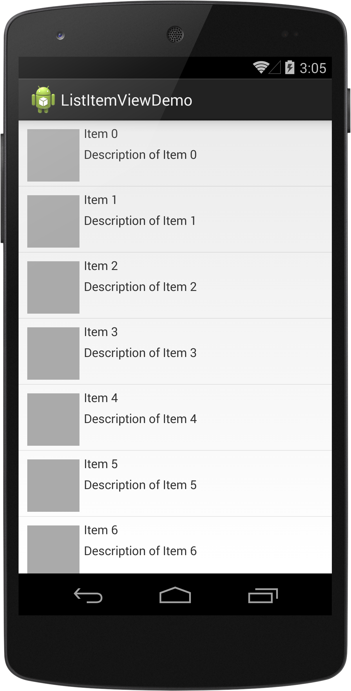

# Customizing Android ListView Rows by Subclassing

Every Android programmer will at some point customize a `ListView` row by creating their own layout and populating it with data. In this post we compare a common implementation, the "holder" pattern, with subclassing `ViewGroup` to encapsulate the grunt work.

---

## The Goal

For demonstration purposes, we'll create a typical simple custom `ListView` row with an `ImageView` and two `TextView`s arranged inside a `RelativeLayout` parent. You can see what it looks like in the screen shot below. You can find the code for this [example project on github](https://github.com/bignerdranch/android-listview-custom-view).

When creating custom views for a `ListView` or other `AdapterView`, we have a few requirements:

1. Use a custom layout to define the arrangement of child views
2. Take advantage of view recycling when scrolling
3. Efficiently identify and populate child views with data

## The Problems with the Holder Pattern

Since this is such a common problem, patterns have emerged. One implementation you see described all over the Internet is called "the holder pattern." In a nutshell, it entails these steps:

* Create a layout for your row view
* Create a "holder" class with fields to store child views of the row
* For each new inflated row, create a holder instance and assign its fields to the results of calling `findViewById(int)` for each child view
* Set the instance of the holder as the top-level view's tag with `setTag(Object)`
* Reuse (and cast) the holder object for reused row views 

I don't like this pattern, for several reasons:

* It puts too much responsibility in the `Adapter`'s `getView(...)` method
* The "holder" class is typically just boilerplate code and creating it/setting it up is a chore
* The view's tag property requires casting to the correct holder type and is generally kludgy
* It violates encapsulation, since the adapter/holder has to know about the internals of the view representing each item in the list

So, rather than complaining about it all the time, I'll propose an alternative: subclassing!

## Customizing Using a Subclass

Instead of creating a generic view, a holder class and an `Adapter` implementation that knows too much about how to wire them all together, we will use a subclass of `RelativeLayout` for the root view of our custom layout. I call this class `ItemView`. `Item` is the generic model object that represents data within our list using three properties: an image URL, a title and a description.

    public class Item {
        private String mImageUrl;
        private String mTitle;
        private String mDescription;
    
        // constructor, getters and setters elided
    }

`ItemView` is responsible for translating an `Item` into views to render onscreen. As a user of `ItemView` (in the `Adapter` subclass), I want my job to be as simple as possible. I really just need to do two things:

1. Create or reuse an instance of `ItemView` for a row
2. Associate the current row's `Item` with the `ItemView`

You can see the API for this in action in the `ItemAdapter` class:

    public class ItemAdapter extends ArrayAdapter<Item> {
    
        public ItemAdapter(Context c, List<Item> items) {
            super(c, 0, items);
        }
    
        @Override
        public View getView(int position, View convertView, ViewGroup parent) {
            ItemView itemView = (ItemView)convertView;
            if (null == itemView)
                itemView = ItemView.inflate(parent);
            itemView.setItem(getItem(position));
            return itemView;
        }

    }

There are two interesting lines of code here: first, we call `ItemView.inflate(ViewGroup)`, a static method, to return an instance of ItemView if we don't have one to reuse. Then, we populate the view with the data for the current item using `setItem(Item)`. All of the details of how this inflation and population happen is encapsulated within `ItemView`.

`ItemView` acts as its own "holder" by using member variables to store references to its significant child views.

    public class ItemView extends RelativeLayout {
        private TextView mTitleTextView;
        private TextView mDescriptionTextView;
        private ImageView mImageView;

        ...
    }

The `inflate(ViewGroup)` static method makes it simple to create a properly-configured `ItemView` in code while still taking advantage of an XML layout resource for easy configuration-based customization.

    public static ItemView inflate(ViewGroup parent) {
        ItemView itemView = (ItemView)LayoutInflater.from(parent.getContext())
                .inflate(R.layout.item_view, parent, false);
        return itemView;
    }

It uses the `parent` argument (in this case the `ListView`) to get a `Context` and inflate the `R.layout.item_view` layout resource, returning the root `ItemView` found there. If we look at the layout, we can see that it is just one element:

    <com.bignerdranch.android.listitemviewdemo.ItemView
        xmlns:android="http://schemas.android.com/apk/res/android"
        android:layout_width="match_parent"
        android:layout_height="wrap_content"
        android:padding="5dp" />

All we have in that file is an instance of `ItemView` with some basic padding specified. Note in particular that there are no child views here. Where are the `ImageView` and the two `TextView`s? To find them we have to look at the constructor for `ItemView`, where it inflates a secondary layout for its children.

    public ItemView(Context context, AttributeSet attrs, int defStyle) {
        super(context, attrs, defStyle);
        LayoutInflater.from(context).inflate(R.layout.item_view_children, this, true);
        setupChildren();
    }

This constructor will (eventually) be called during the process of inflating the layout containing the `ItemView` element. When that happens, we call through to the superclass constructor to take care of the standard attributes, and then we inflate `R.layout.item_view_children` to add the child views of interest to the current `ItemView` instance. This layout looks like this:

    <?xml version="1.0" encoding="utf-8"?>
    <merge
      xmlns:android="http://schemas.android.com/apk/res/android"
      android:layout_width="match_parent"
      android:layout_height="wrap_content" >
      <ImageView
        android:id="@+id/item_imageView"
        android:background="@android:color/darker_gray"
        android:layout_width="60dp"
        android:layout_height="60dp"
        android:layout_margin="5dp"
        android:contentDescription="@string/item_imageView_contentDescription"
        />
      <TextView
        android:id="@+id/item_titleTextView"
        android:layout_width="wrap_content"
        android:layout_height="wrap_content"
        android:layout_toRightOf="@id/item_imageView"
        android:text="title text"
        />
      <TextView
        android:id="@+id/item_descriptionTextView"
        android:layout_width="wrap_content"
        android:layout_height="wrap_content"
        android:layout_toRightOf="@id/item_imageView"
        android:layout_below="@id/item_titleTextView"
        android:layout_marginTop="5dp"
        android:text="description text"
        />
    </merge>

The root element is a `merge` tag, which means that during inflation, each of the children of that tag will be added as children of the `parent` argument passed to the `inflate(...)` method in the constructor. After that is done, we call our private `setupChildren()` method to wrap up the work of calling `findViewById(int)` and associating the child views with the appropriate member variables.

    private void setupChildren() {
        mTitleTextView = (TextView) findViewById(R.id.item_titleTextView);
        mDescriptionTextView = (TextView) findViewById(R.id.item_descriptionTextView);
        mImageView = (ImageView) findViewById(R.id.item_imageView);
    }

At this point, `ItemView` is capable of doing everything the "holder" class would typically do. It will cache these child-view references in its own member variables, and there is no need to use the "tag" for anything.

For convenience, we also provide the `setItem(Item)` method for callers to use to populate the child views with an `Item`'s data:

    public void setItem(Item item) {
        mTitleTextView.setText(item.getTitle());
        mDescriptionTextView.setText(item.getDescription());
        // TODO: set up image URL
    }

That's basically all there is to this pattern. It provides several advantages:

* The `Adapter` implementation is greatly simplified
* The `ItemView` can be created easily in code or in an XML layout file
* Any future customizations or configuration-specific changes to the layout of `ItemView` can be handled entirely within that class' implementation and layout files
* There are no extra "holder" classes or objects created during the process

Arguably, it has some disadvantages or oddities as well. The use of two layout files (one for the view and one for its children) slightly complicates the setup. If we just used one layout file containing `ItemView` and its children, we could eliminate this issue, but it would make the implementation of `ItemView`'s constructor depend on the correct layout being inflated to trigger it.

